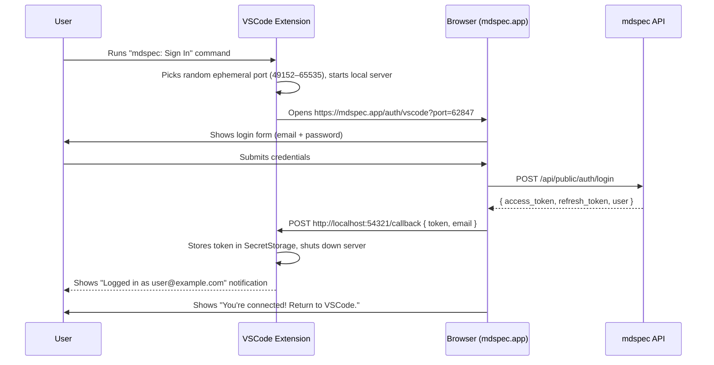

# VSCode Extension Login — Specification (Browser-Based Flow)

## Overview

The extension authenticates users via a **browser-based login flow**. Instead of embedding a login form inside VSCode, the extension opens the real mdspec website in the user's default browser. After the user logs in, the website sends the token back to a temporary local server the extension is listening on.

This approach is more secure (credentials never touch the extension), more familiar (users see the real mdspec UI), and supports SSO/social login in the future.

---

## 1. Authentication Flow



---

## 2. Components to Build

### 2.1 On the mdspec Web App (Next.js)

| File | Purpose |
|---|---|
| `src/app/auth/vscode/page.tsx` | Special login page that accepts a `?port=` query param and, after login, POSTs the token to `localhost:<port>/callback` |

### 2.2 In the VSCode Extension

| File | Purpose |
|---|---|
| `src/extension.ts` | Registers commands |
| `src/auth/AuthManager.ts` | Secure token storage via `SecretStorage` |
| `src/auth/BrowserLogin.ts` | Starts local server, opens browser, waits for token |

---

## 3. Web App — `/auth/vscode` Page

### How it works

1. The page reads `?port=<number>` from the URL.
2. It shows a standard email/password login form.
3. On submit, it calls `POST /api/public/auth/login`.
4. On success, it POSTs `{ token, refreshToken, email }` to `http://localhost:<port>/callback`.
5. It then shows a success message: *"You're connected! Return to VSCode."*

### Implementation (`src/app/auth/vscode/page.tsx`)

```tsx
'use client';

import { useState } from 'react';
import { useSearchParams } from 'next/navigation';

export default function VscodeAuthPage() {
    const searchParams = useSearchParams();
    const port = searchParams.get('port');

    const [email, setEmail] = useState('');
    const [password, setPassword] = useState('');
    const [error, setError] = useState<string | null>(null);
    const [loading, setLoading] = useState(false);
    const [done, setDone] = useState(false);

    async function handleSubmit(e: React.FormEvent) {
        e.preventDefault();
        setLoading(true);
        setError(null);

        try {
            // 1. Authenticate with mdspec API
            const res = await fetch('/api/public/auth/login', {
                method: 'POST',
                headers: { 'Content-Type': 'application/json' },
                body: JSON.stringify({ email, password }),
            });

            const data = await res.json();
            if (!res.ok) throw new Error(data.error || 'Login failed');

            // 2. Send token to the extension's local server
            await fetch(`http://localhost:${port}/callback`, {
                method: 'POST',
                headers: { 'Content-Type': 'application/json' },
                body: JSON.stringify({
                    token: data.session.access_token,
                    refreshToken: data.session.refresh_token,
                    email: data.user.email,
                }),
            });

            setDone(true);

        } catch (err: unknown) {
            setError(err instanceof Error ? err.message : 'Something went wrong');
        } finally {
            setLoading(false);
        }
    }

    if (!port) {
        return (
            <div className="min-h-screen flex items-center justify-center bg-slate-50 dark:bg-slate-900">
                <p className="text-red-500">Invalid link. Please use the "Sign In" command in VSCode.</p>
            </div>
        );
    }

    if (done) {
        return (
            <div className="min-h-screen flex items-center justify-center bg-slate-50 dark:bg-slate-900">
                <div className="text-center space-y-3">
                    <div className="text-4xl">✅</div>
                    <h1 className="text-2xl font-bold text-slate-900 dark:text-white">You're connected!</h1>
                    <p className="text-slate-600 dark:text-slate-400">Return to VSCode — you're now signed in.</p>
                </div>
            </div>
        );
    }

    return (
        <div className="min-h-screen flex items-center justify-center bg-slate-50 dark:bg-slate-900">
            <div className="w-full max-w-md p-8 space-y-6 bg-white dark:bg-slate-800/50 rounded-2xl border border-slate-200 dark:border-slate-700 shadow-xl">
                <div className="text-center">
                    <h1 className="text-2xl font-bold text-slate-900 dark:text-white">Sign in to mdspec</h1>
                    <p className="mt-1 text-slate-500 dark:text-slate-400 text-sm">
                        Connecting your VSCode workspace
                    </p>
                </div>

                {error && (
                    <div className="p-3 rounded-lg bg-red-50 dark:bg-red-500/10 border border-red-200 dark:border-red-500/20 text-red-600 dark:text-red-400 text-sm">
                        {error}
                    </div>
                )}

                <form onSubmit={handleSubmit} className="space-y-4">
                    <div>
                        <label htmlFor="email" className="block text-sm font-medium text-slate-700 dark:text-slate-300 mb-1">
                            Email
                        </label>
                        <input
                            id="email"
                            type="email"
                            value={email}
                            onChange={(e) => setEmail(e.target.value)}
                            required
                            className="w-full px-4 py-2.5 bg-white dark:bg-slate-800 border border-slate-200 dark:border-slate-700 rounded-lg text-slate-900 dark:text-white placeholder-slate-400 focus:outline-none focus:ring-2 focus:ring-blue-500"
                            placeholder="you@example.com"
                        />
                    </div>

                    <div>
                        <label htmlFor="password" className="block text-sm font-medium text-slate-700 dark:text-slate-300 mb-1">
                            Password
                        </label>
                        <input
                            id="password"
                            type="password"
                            value={password}
                            onChange={(e) => setPassword(e.target.value)}
                            required
                            className="w-full px-4 py-2.5 bg-white dark:bg-slate-800 border border-slate-200 dark:border-slate-700 rounded-lg text-slate-900 dark:text-white placeholder-slate-400 focus:outline-none focus:ring-2 focus:ring-blue-500"
                            placeholder="••••••••"
                        />
                    </div>

                    <button
                        type="submit"
                        disabled={loading}
                        className="w-full py-2.5 bg-blue-600 hover:bg-blue-500 text-white font-medium rounded-lg transition-all disabled:opacity-50 disabled:cursor-not-allowed"
                    >
                        {loading ? 'Signing in…' : 'Sign in to VSCode'}
                    </button>
                </form>
            </div>
        </div>
    );
}
```

---

## 4. VSCode Extension Implementation

### 4.1 Token Storage (`src/auth/AuthManager.ts`)

```typescript
import * as vscode from 'vscode';

const TOKEN_KEY    = 'mdspec.accessToken';
const REFRESH_KEY  = 'mdspec.refreshToken';
const USER_KEY     = 'mdspec.userEmail';

export class AuthManager {
    constructor(private readonly context: vscode.ExtensionContext) {}

    async saveSession(accessToken: string, refreshToken: string, email: string) {
        await this.context.secrets.store(TOKEN_KEY, accessToken);
        await this.context.secrets.store(REFRESH_KEY, refreshToken);
        await this.context.globalState.update(USER_KEY, email);
    }

    async getAccessToken(): Promise<string | undefined> {
        return this.context.secrets.get(TOKEN_KEY);
    }

    async getUserEmail(): Promise<string | undefined> {
        return this.context.globalState.get<string>(USER_KEY);
    }

    async clearSession() {
        await this.context.secrets.delete(TOKEN_KEY);
        await this.context.secrets.delete(REFRESH_KEY);
        await this.context.globalState.update(USER_KEY, undefined);
    }

    async isLoggedIn(): Promise<boolean> {
        return !!(await this.getAccessToken());
    }
}
```

### 4.2 Browser Login Handler (`src/auth/BrowserLogin.ts`)

```typescript
import * as vscode from 'vscode';
import * as http from 'http';
import { AuthManager } from './AuthManager';

const MDSPEC_BASE = 'https://mdspec.app';

export async function startBrowserLogin(authManager: AuthManager): Promise<void> {
    return new Promise((resolve, reject) => {
        // 1. Start a one-shot local HTTP server on a random available port
        const server = http.createServer(async (req, res) => {
            // Allow the browser page to POST here (CORS for localhost)
            res.setHeader('Access-Control-Allow-Origin', MDSPEC_BASE);
            res.setHeader('Access-Control-Allow-Methods', 'POST, OPTIONS');
            res.setHeader('Access-Control-Allow-Headers', 'Content-Type');

            if (req.method === 'OPTIONS') {
                res.writeHead(204);
                res.end();
                return;
            }

            if (req.method === 'POST' && req.url === '/callback') {
                let body = '';
                req.on('data', chunk => { body += chunk; });
                req.on('end', async () => {
                    try {
                        const { token, refreshToken, email } = JSON.parse(body);
                        await authManager.saveSession(token, refreshToken, email);

                        res.writeHead(200, { 'Content-Type': 'application/json' });
                        res.end(JSON.stringify({ ok: true }));

                        vscode.window.showInformationMessage(`mdspec: Logged in as ${email}`);
                        server.close();
                        resolve();
                    } catch (err) {
                        res.writeHead(400);
                        res.end('Bad request');
                        reject(err);
                    }
                });
                return;
            }

            res.writeHead(404);
            res.end();
        });

        // 2. Pick a random port in the IANA ephemeral range (49152–65535).
        //    This avoids colliding with common developer services (3000, 8080, 5432, etc.).
        //    The web app page validates that the port is in this range before accepting it.
        const ephemeralPort = Math.floor(Math.random() * (65535 - 49152 + 1)) + 49152;
        server.listen(ephemeralPort, '127.0.0.1', () => {
            const port = ephemeralPort;

            // 3. Open the browser to the mdspec login page with the port
            const loginUrl = `${MDSPEC_BASE}/auth/vscode?port=${port}`;
            vscode.env.openExternal(vscode.Uri.parse(loginUrl));

            vscode.window.showInformationMessage(
                'mdspec: A browser window has opened. Please sign in.',
                'Cancel'
            ).then(selection => {
                if (selection === 'Cancel') {
                    server.close();
                    reject(new Error('Login cancelled'));
                }
            });

            // 4. Auto-timeout after 5 minutes
            setTimeout(() => {
                server.close();
                reject(new Error('Login timed out'));
            }, 5 * 60 * 1000);
        });

        server.on('error', reject);
    });
}
```

### 4.3 Registering Commands (`src/extension.ts`)

```typescript
import * as vscode from 'vscode';
import { AuthManager } from './auth/AuthManager';
import { startBrowserLogin } from './auth/BrowserLogin';

export function activate(context: vscode.ExtensionContext) {
    const authManager = new AuthManager(context);

    context.subscriptions.push(
        vscode.commands.registerCommand('mdspec.login', async () => {
            if (await authManager.isLoggedIn()) {
                const email = await authManager.getUserEmail();
                vscode.window.showInformationMessage(`mdspec: Already signed in as ${email}`);
                return;
            }
            try {
                await startBrowserLogin(authManager);
            } catch (err: unknown) {
                if (err instanceof Error && err.message !== 'Login cancelled') {
                    vscode.window.showErrorMessage(`mdspec: Login failed — ${err.message}`);
                }
            }
        }),

        vscode.commands.registerCommand('mdspec.logout', async () => {
            await authManager.clearSession();
            vscode.window.showInformationMessage('mdspec: Signed out.');
        })
    );
}

export function deactivate() {}
```

---

## 5. `package.json` Contributions

```json
{
  "contributes": {
    "commands": [
      { "command": "mdspec.login",  "title": "mdspec: Sign In"  },
      { "command": "mdspec.logout", "title": "mdspec: Sign Out" }
    ]
  },
  "activationEvents": [
    "onCommand:mdspec.login",
    "onCommand:mdspec.logout"
  ]
}
```

---

## 6. Using the Token in API Calls

```typescript
async function listSpecs(authManager: AuthManager) {
    const token = await authManager.getAccessToken();
    if (!token) {
        vscode.window.showWarningMessage('Please sign in first. Run: mdspec: Sign In');
        return;
    }

    const res = await fetch('https://mdspec.app/api/public/specs', {
        headers: { Authorization: `Bearer ${token}` },
    });

    if (res.status === 401) {
        vscode.window.showWarningMessage('Session expired. Please sign in again.');
        return;
    }

    const { specs } = await res.json();
    return specs;
}
```

---

## 7. Security Considerations

| Concern | Mitigation |
|---|---|
| Token storage | `context.secrets` (OS keychain / encrypted) — never `globalState` |
| Local server exposure | Binds to `127.0.0.1` only (not `0.0.0.0`), not reachable from network |
| CORS on local server | Restricts `Access-Control-Allow-Origin` to `https://mdspec.app` only |
| Port safety | Extension picks a random port in the IANA ephemeral range (49152–65535), avoiding common developer ports (3000, 8080, 5432, etc.) |
| Port validation | The web app page rejects any `?port=` value outside 49152–65535, preventing malicious links from targeting local services |
| Timeout | Local server auto-closes after 5 minutes if no callback received |
| HTTPS only | All calls to mdspec API use HTTPS |

---

## 8. UX States

| State | Behavior |
|---|---|
| Not logged in | `mdspec.login` opens browser, shows info message |
| Browser opened | Notification with "Cancel" option shown in VSCode |
| Login success | Browser shows success page, VSCode shows notification, server closes |
| Login error | Error shown in browser; VSCode notification if server-side failure |
| Timeout (5 min) | Server closes, error notification shown in VSCode |
| Already logged in | Skips browser, shows "Already signed in as …" |
| Logged out | `mdspec.logout` clears storage, shows confirmation |
